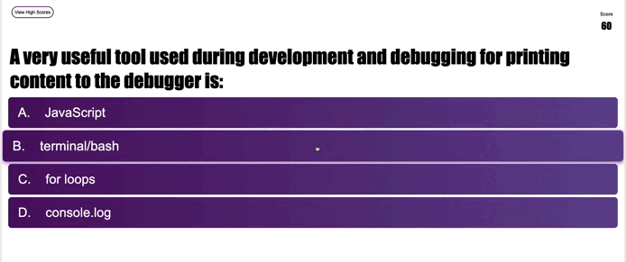

# 04 Web APIs: Code Quiz
Coding Quiz Challenge
https://github.com/peterwonghg/C04-Quiz.git
https://peterwonghg.github.io/C04-Quiz/


## User Story
```
AS A coding boot camp student
I WANT to take a timed quiz on JavaScript fundamentals that stores high scores
SO THAT I can gauge my progress compared to my peers
```

## Acceptance Criteria

GIVEN I am taking a code quiz

WHEN I click the start button

THEN a timer starts and I am presented with a question


WHEN I answer a question

THEN I am presented with another question


WHEN I answer a question incorrectly

THEN time is subtracted from the clock


WHEN all questions are answered or the timer reaches 0
THEN the game is over


WHEN the game is over

THEN I can save my initials and my score


## Comments
```
The structure and the design of this quiz is based on Brian Design - How to Make a Quiz App using HTML CSS Javascript - Vanilla Javascript Project for Beginners Tutorial with the following differences to keep within Challenge 04 constraints, the following differences are:

1. scoring changed based on count down timer
2. elimination of progress bar

The main structure of the quiz is made up of the following components:

1. Home (Index) Page with a title, game rules a Start Quiz button that launches the quiz and the View High Score that takes you to the High Score Page

2. Quiz pages containing individual question with the answer choices. When the correct answer is chosen, a green background on the selected choice is displayed.  If the incorrect answer is chosen, a red background on the selected choice is displayed.

A View High Score button is also available to go to the High Score page, however the game will be terminated at that point when this button is selected.

When the timer runs out, a display box will appear that will enable the quiz participant to retake the quiz through the home page.

3. End page enables your initial to be entered and enabling your initial and score be saved and displayed in the High Scire page if the highest 10 score is achieved.  The submit button cannot be activated until an initial had been entered.  Your score is also displayed and a Restart Quiz button acailable if player intends to try again.

4. A High Score page with saved Top 10 scores displayed togethert with Quiz Home Page button to return to the home page.

```


## Reference

```
https://www.youtube.com/watch?v=f4fB9Xg2JEY
Brian Design - How to Make a Quiz App using HTML CSS Javascript - Vanilla Javascript Project for Beginners Tutorial
```


© 2023 PWongi. Confidential and Proprietary. All Rights Reserved.
